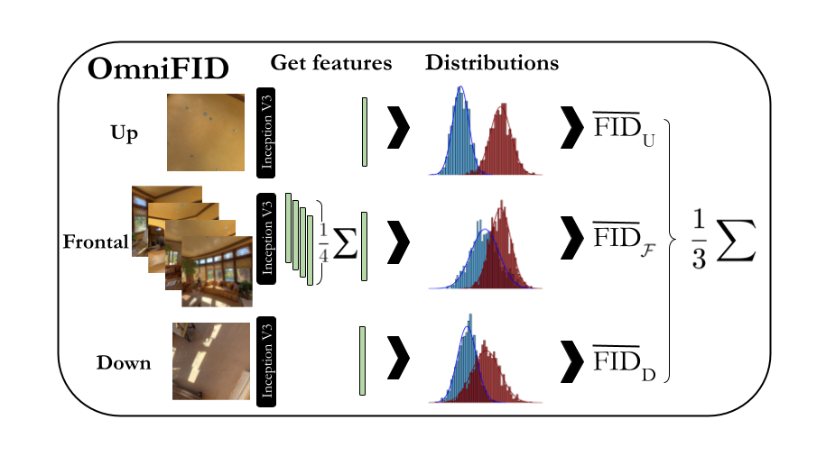

# Omnidirectional FID
Repository for [Geometry Fidelity for Spherical Images](https://arxiv.org/abs/2407.18207), accepted at ECCV 2024.  

A reimplementation of the code for calculating OmniFID and DS will be added to this repository (currently waiting for approval).

  

  
## Contact 

If you have questions or requests, please reach out to

Anders Christensen: andchri@dtu.dk
